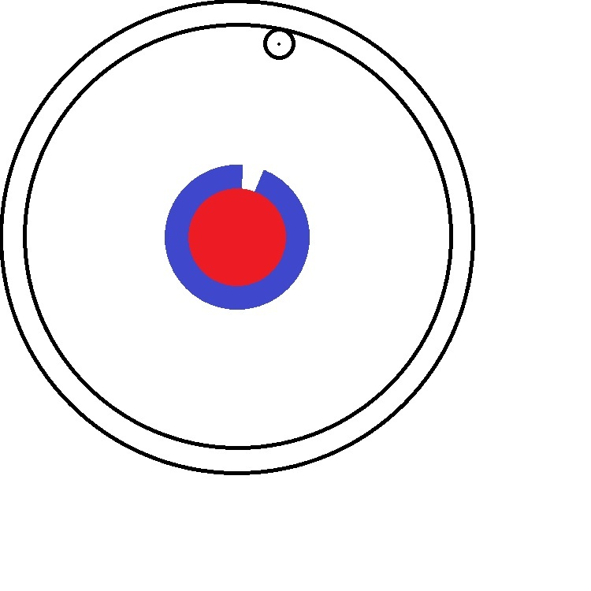

# 圆形二维码

## 样图

图形特征规格说明：

* 以垂直向上的方向为基准方向；

* 半径为2单位的红色实心区域；半径2-3单位圆环，白+蓝底；前两部分共同组成基本校验圈；

* 半径3-9单位为透明区域；半径9-10单位为编码区域；

* 2-3单位的白底位于0-30°，剩余都是蓝底；

* 编码填充黑白色区分代表01，以10°为1位；容错算法待定；

* 样图规格为每单位10像素。

## 主要流程

* 视频流预处理

* 识别圆并获取圆集合

* 筛选满足条件的圆剪切

* 透视变换

……

## 具体实现

主要工程文件为：demo.py

由于opencv大部分算法都只支持二值化图形，识别圆的函数无法直接获取红色圆，需要自己写方法筛选；

### 预处理

main函数主体是一个循环，读视频流，逐帧通过deal函数处理。截取到合适的画面暂停，按q手动退出。

### 识别圆

主要有两种识别圆的方法：

其一是demo中使用的SimpleBlobDetector_Params方法，识别类似圆的区块；

其二是fitEllipse椭圆扩展函数，画出最接近轮廓的椭圆，效果不如前者；

demo中的deal函数；

### 筛选

识别到圆后，按特征规格，分别算圆环内各色点所占比例，达到阈值的单独截图；

deal函数中的baseCheck函数及for循环里cutRadius的部分；

处理结果见part.png

### 透视变换

主要使用findHomography或warpPerspective函数；

findHomography需要原图（即example.jpg）和待处理图，通过特征点识别算法获取两张图的特征点，对比其中相似的部分，再通过矩阵变化获取到导正后的图片；

warpPerspective不需要原图，手动给出做矩阵变换需要的参数；

目前只完成到这里，findHomography特征点识别问题较大，不清楚是图片像素的问题还是算法问题，如果需要继续进行，可能需要进一步研究特征识别算法。

特征点对比见matches.jpg，变换结果见aligned.jpg。
